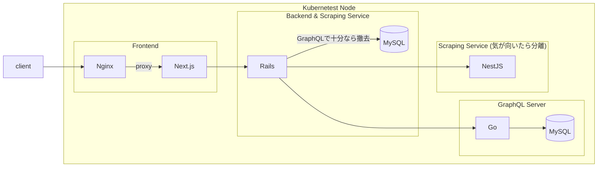

# price-monitoring

価格監視ツール

Web上にある欲しい物の価格監視を行うことができる (予定)

## 技術スタック (予定)

### Frontend

- Next.js
- TypeScript
- TailwindCSS

### Backend

- Rails7

### GraphQL Server

- Go
- gqlgen

### 開発インフラ

- Docker Compose

### デプロイ

- 自宅Kubernetes (Master Node x 1, Worker Node x 2構成)

## アーキテクチャ (予定)

## 備考

- プロキシサーバの構成（自分用ならそもそも不要だが、学習用としてNginxを挟むのが良いかも）
- スクレイピングサーバは別で立てても良いかも (NestJS + Fastify + Puppeteer)

## TODO

- 各コンテナの初期構築
  - ✅ frontend
  - ✅ backend
  - ✅ graphql
  - ✅ db
- 各コンテナの疎通
  - frontend <-> backend
  - backend <-> backend_db
  - backend <-> graphql
  - ✅ graphql <-> graphql_db
- 実装
  - frontend
    - 管理画面
  - backend
    - スクレイピングロジック
  - graphql
    - ユーザー情報を保持
    - スクレイピング結果を保持
- デプロイ
  - 簡単なハッピーパスがクリアできた時点でk8sにデプロイ
