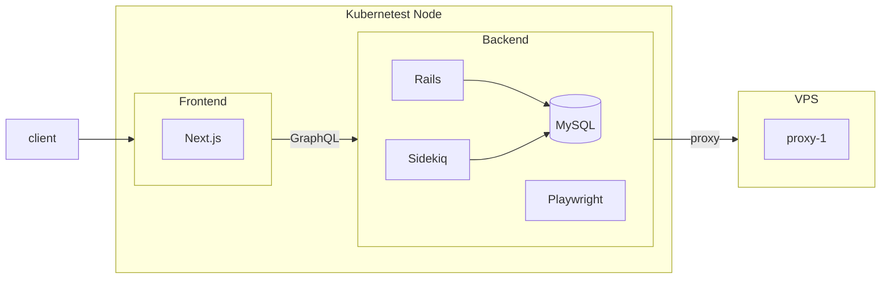
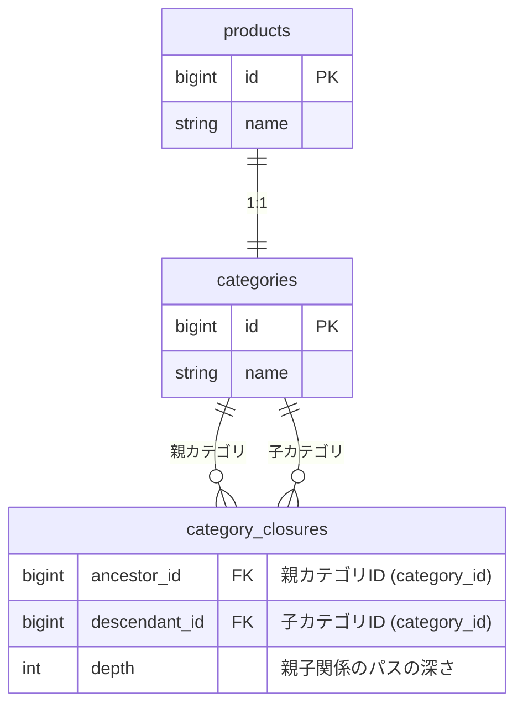
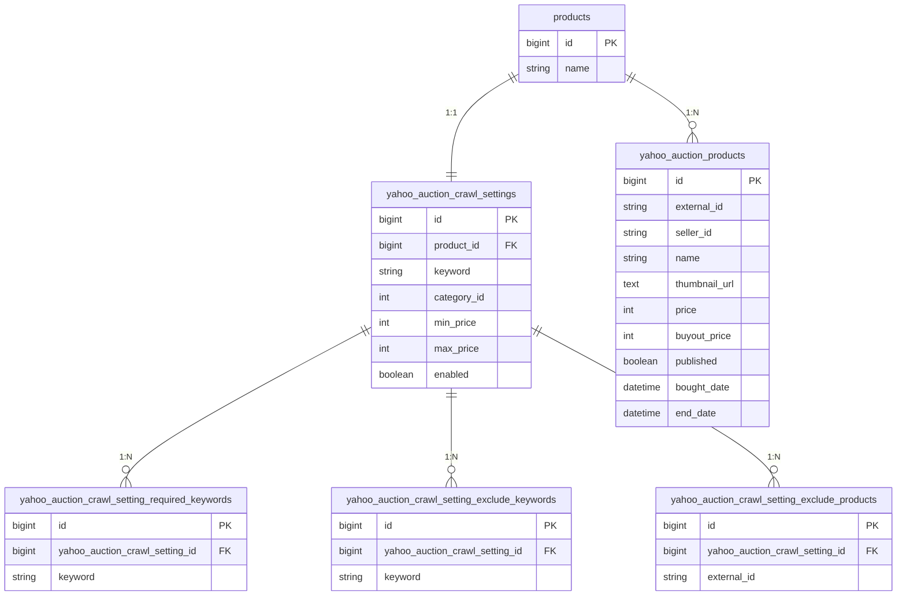
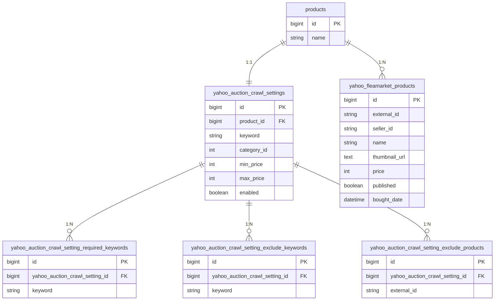
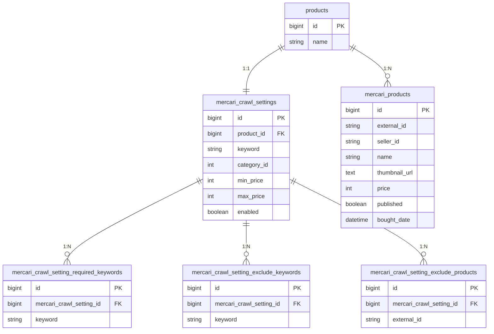
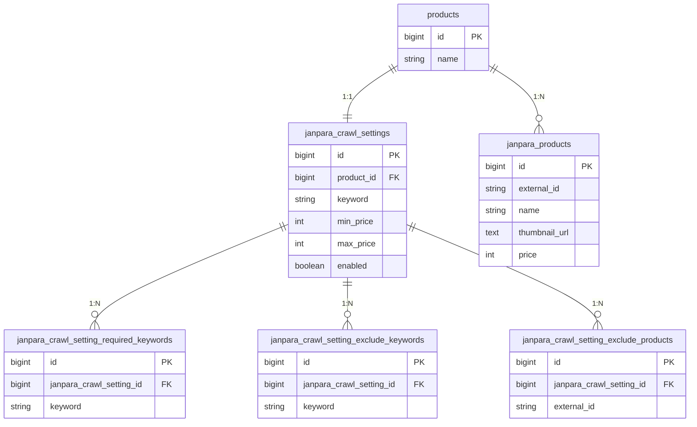
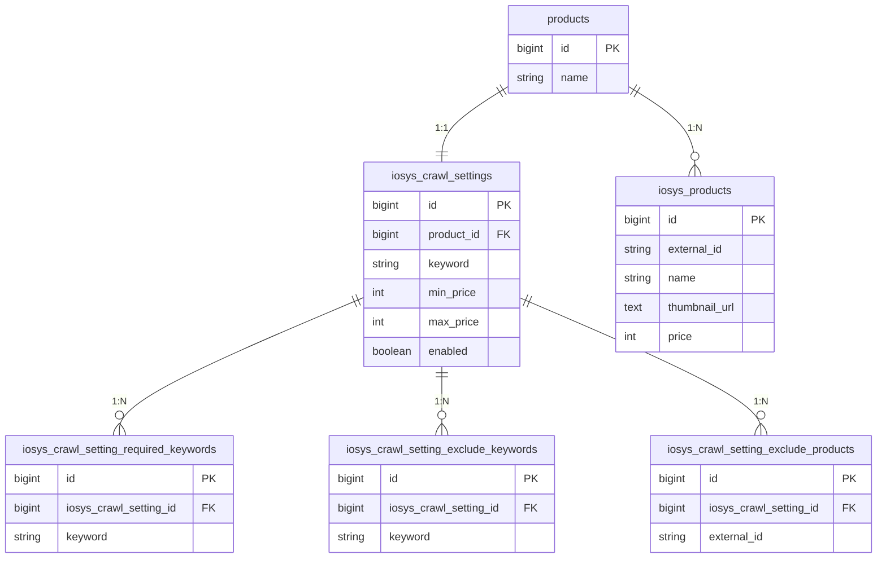
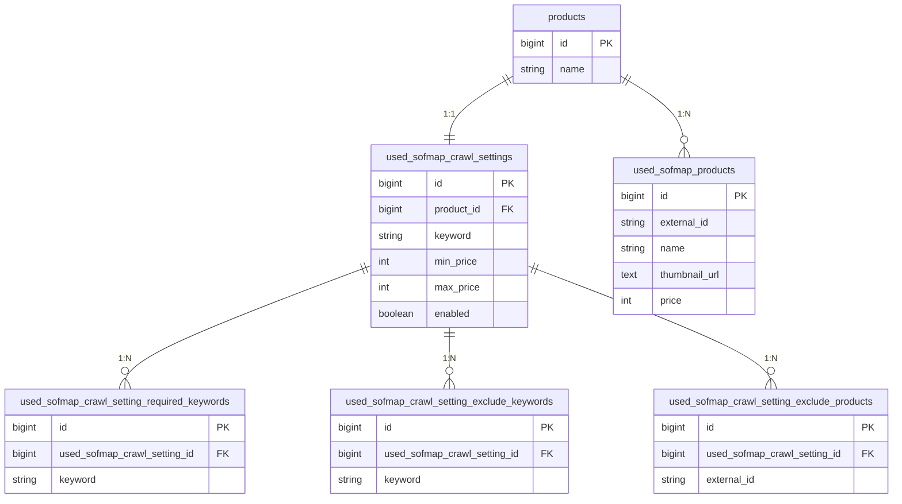
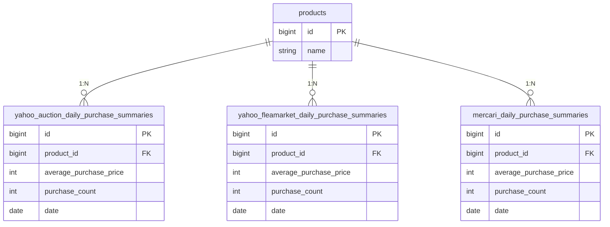
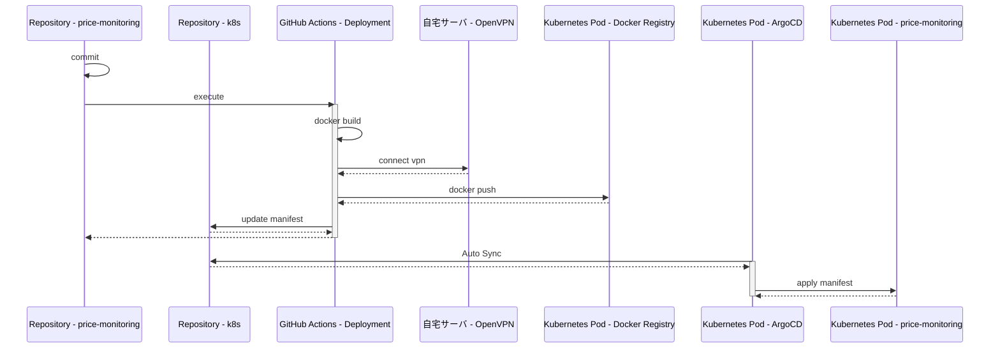

# price-monitoring

[](https://github.com/kuroweb/price-monitoring/actions/workflows/deployment.yml)

Web上にある商品の最安値を探したり、相場を把握するためのツール

開発目的としては、GraphQL, TypeScriptの学習目的である

## 技術スタック

### Frontend

- Next.js
- TypeScript
- TailwindCSS

### Backend

- Rails
- graphql-ruby

## Infra

### Development

- Docker Compose

### Production

- 自宅Kubernetes (Master Node x 1, Worker Node x 3構成)

## アーキテクチャ



## ER

### 計測対象管理



### クロール処理

#### ヤフオク



#### ヤフーフリマ



#### メルカリ



#### じゃんぱら



#### イオシス



#### パソコン工房


#### リコレ



### 相場集計



## 自動デプロイ

- ArgoCDによるGitOps
- [k8sマニフェスト](https://github.com/kuroweb/k8s)



## Docs

### seedファイル

すべてのSeedを投入する

```bash
rails db:seed -e {environment}
```

特定のSeedを投入する([rakeタスク拡張](/volumes/backend/lib/tasks/seed.rake))

```bash
rails db:seed:{seed_name} -e {environment}
```
