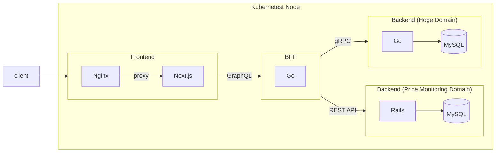
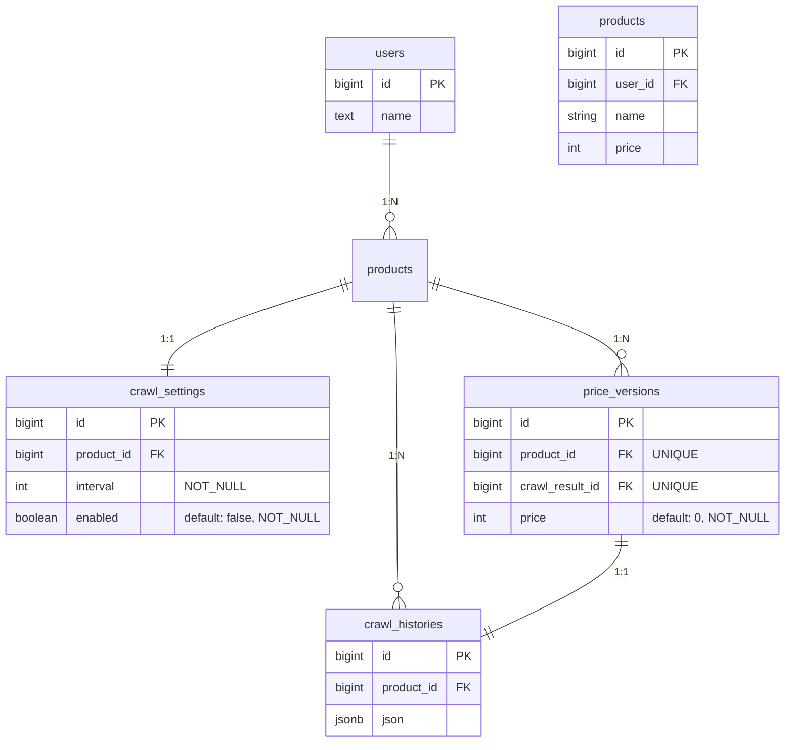

# price-monitoring

価格監視ツール

Web上にある欲しい物の価格監視を行うことができる

## 技術スタック

### Frontend

- Next.js
- TypeScript
- TailwindCSS

### BFF

- Go
- gqlgen

### Backend (Price Monitoring Domain)

- Rails

### 開発インフラ

- Docker Compose

### デプロイ

- 自宅Kubernetes (Master Node x 1, Worker Node x 2構成)

## アーキテクチャ

## ER

### Price Monitoring

