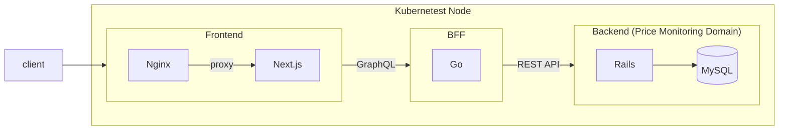

# price-monitoring

価格監視ツール

Web上にある欲しい物の価格監視を行うことができる (予定)

## 技術スタック (予定)

### Frontend

- Next.js
- TypeScript
- TailwindCSS

### Backend

- Rails7

### GraphQL Server

- Go
- gqlgen

### 開発インフラ

- Docker Compose

### デプロイ

- 自宅Kubernetes (Master Node x 1, Worker Node x 2構成)

## アーキテクチャ (予定)

## 備考

- プロキシサーバの構成（自分用ならそもそも不要だが、学習用としてNginxを挟むのが良いかも）
- スクレイピングサーバは別で立てても良いかも (NestJS + Fastify + Puppeteer)

## TODO

- 各コンテナの初期構築
  - ✅ frontend
  - ✅ bff
  - ✅ backend
  - ✅ backend_db
- 各コンテナの疎通
  - frontend <-> bff
  - bff <-> backend
  - ✅ backend <-> backend_db
- 実装
  - frontend
    - 管理画面
  - bff
    - GraphQLでfrontendとbackendを繋ぐ
  - backend
    - REST APIでのCRUD操作を実装
    - 価格監視のドメインロジックを実装
      - ユーザー情報を保持（暫定対応、将来的には切り出すかも）
      - スクレイピング結果を保持
- デプロイ
  - 簡単なハッピーパスがクリアできた時点でk8sにデプロイ
