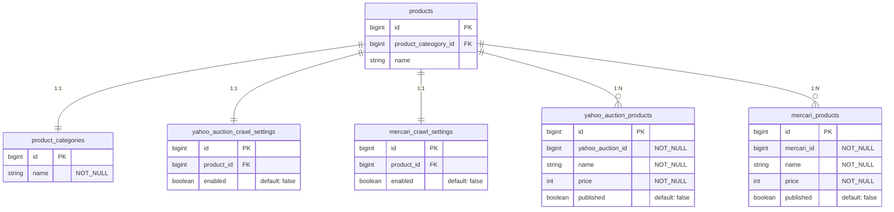

# price-monitoring

[](https://github.com/kuroweb/price-monitoring/actions/workflows/deployment.yml)

価格監視ツール

Web上にある欲しい物の価格監視を行うことができる

## 技術スタック

### Frontend

- Next.js
- TypeScript
- TailwindCSS

### BFF

- Go
- gqlgen

### Backend (Price Monitoring Domain)

- Rails

### 開発インフラ

- Docker Compose

### デプロイ

- 自宅Kubernetes (Master Node x 1, Worker Node x 2構成)
- ArgoCDで自動デプロイ

## アーキテクチャ


## ER

### Price Monitoring



## Docs

### seedファイル

すべてのSeedを投入する

```bash
rails db:seed -e {environment}
```

特定のSeedを投入する([rakeタスク拡張](/volumes/backend/lib/tasks/seed.rake))

```bash
rails db:seed:{seed_name} -e {environment}
```
