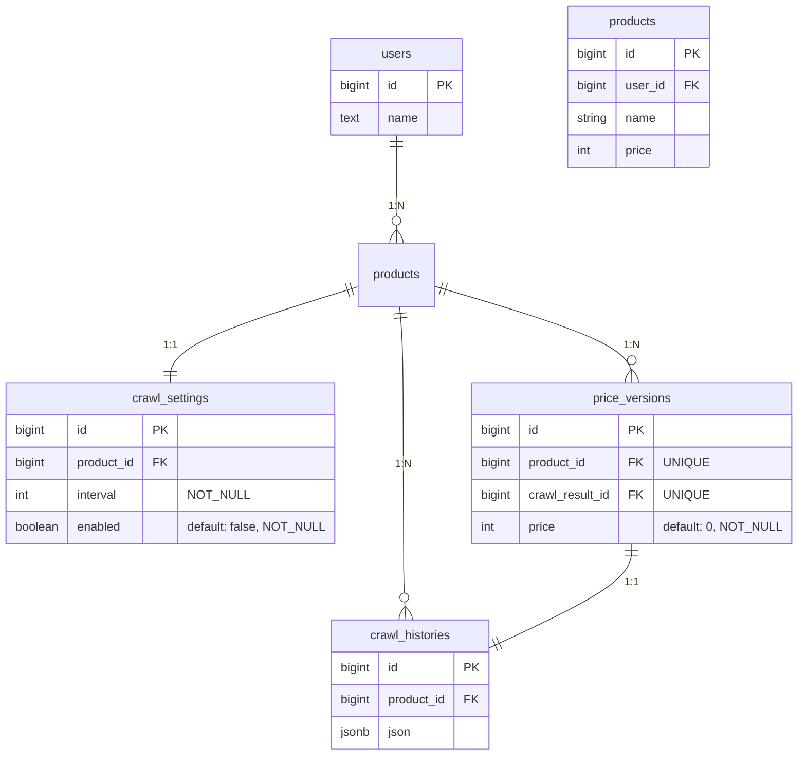

- [ER](#er)

# ER

```mermaid
erDiagram
  users {
    bigint id PK
    text name
  }
  products　{
    bigint id PK
    bigint user_id FK
    string name
    int price
  }
  crawl_settings {
    bigint id PK
    bigint product_id FK
    int interval "NOT_NULL"
    boolean enabled "default: false, NOT_NULL"
  }
  price_versions {
    bigint id PK
    bigint product_id FK "UNIQUE"
    bigint crawl_result_id FK "UNIQUE"
    int price "default: 0, NOT_NULL"
  }
  crawl_histories {
    bigint id PK
    bigint product_id FK
    jsonb json
  }

  users ||--o{ products : "1:N"
  products ||--|| crawl_settings : "1:1"
  products ||--o{ price_versions : "1:N"
  products ||--o{ crawl_histories : "1:N"
  price_versions ||--|| crawl_histories : "1:1"
```
